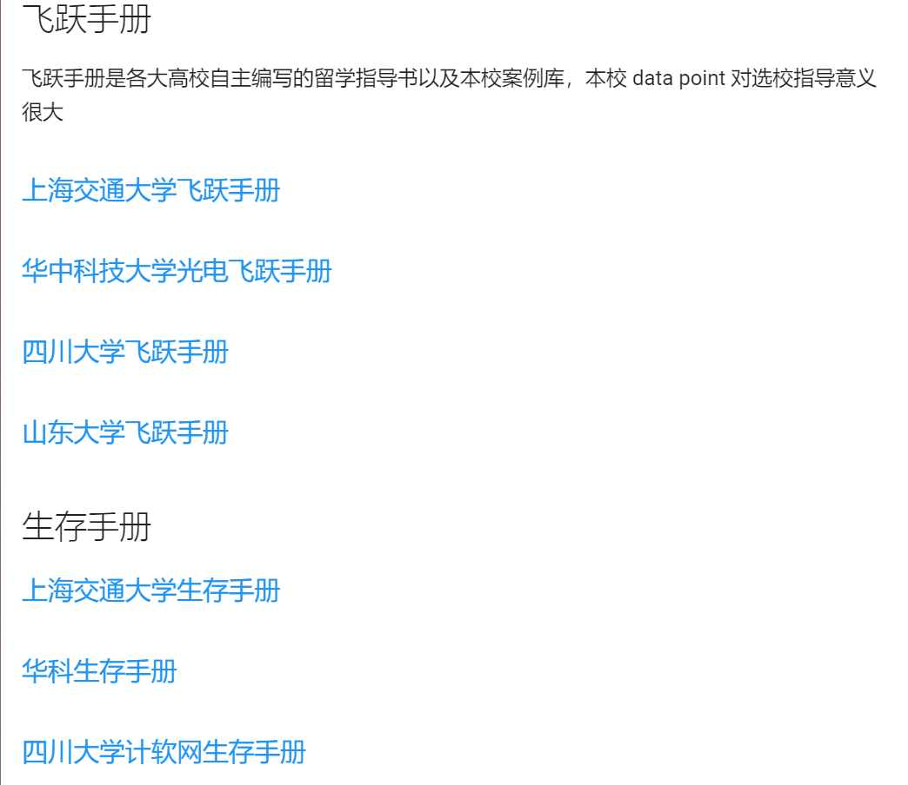
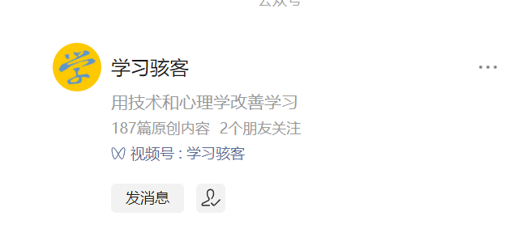
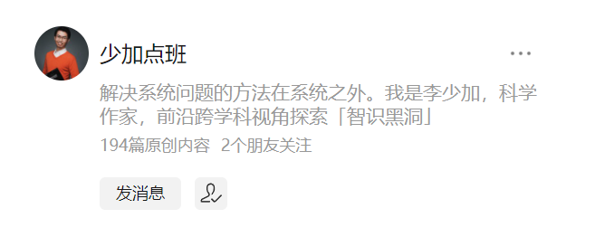

# awasome_university_tips
## GPA
提升 gpa 可以从以下方面入手
1. 平时上课认真听讲, 下课多问老师问题, 认真完成老师布置的课后题，平常与老师处好关系。 
在考前一周的时候，老师为了防止学生挂科， 通常会复习考试重点，这个时候讲的很多题都是考试原题，可以认真笔记
大学期末考试与高中不同，老师讲的就是要考的，同时考过的还会考，而且通常是一模一样的原题，所以复习的策略就是：**老师讲的重点** + **学校的历年卷**
2. 选好课，可以向学长学姐了解一下有没有那种分高事少的课
3. 学分抵充：这个需要了解一下学校政策，通常获奖在校级以上就可以抵充相关学分

**绩点高的关键还是要平时下功夫, 将教材上的知识点理解好, 并充分运用, 绩点肯定不低, 如果只是考前突击, 虽然不会挂科, 但是一定不会拿高绩点**
## 相关大学手册(非常好的资源需要认真研读)
以下手册陈述了大学的一些事实, 相对激进一点, 可能与高中情况完全不同, 可以选择性采纳
https://opencs.app/link/

## 英语以及相关考试
英语非常重要, 是决定以后上限的重要一环。 但是如果只是每天记背单词, 一定不够， 原因在于： 没有应用的情景（词不成句），与自己联系不大学习动力不足。

所以我建议考一个经济方面在国际上竞争力的证，原因如下:
1. 因为你是经济专业, 据我所知, 它是比较看重出生的(学校以及相关背景), 有一个高难度的能够证明自己能力的证件是非常重要的
2. 可以提供全浸入式的英语学习, 你如果每天都看得是英语文章英语自然会好。 

## 雅思相关资源
**可以先了解一下雅思考什么， 之后有针对性备考**
https://www.youtube.com/watch?v=vSFEjicW7dY&t=1063s

## 编程以及科研
如果要走偏应用这条路的话, 编程是一定要学的(几乎所有学科必用, 只是深与浅的差别), 但是目前我非常不建议学习编程:
1. 没有应用的场景, 东西用不起来, 学习的动力会不足, 学了等于没有学
2. 编程方面入门门槛一开始比较高, 如果直接自己上手很可能挫败, 打击了学习的信息
3. 想要把编程学精通, 有非常长的路要走, 需要付出很多时间精力  
4. 好的编程资源，全部都是英语

所以相应的解决方法是(需要参照自己的兴趣):
1. 大一, 在学校官网上找教授(最好是教授, 而且比较年轻, 相对愿意给学生指点, 他们会有很多横向项目, 需要学生做), 老师会给你指定一个方向, 至少要配备一个研究生(如果没有, 要思考一下他是否想要带你)。之后你按照这个方向再去学习相关技能会好很多
2. 一开始入门要有一个能够**面对面**给你一些指点的学姐
3. 如果确定了以后要走应用（比如经济方面可以去做数据分析， 并且与现在人工智能相结合，优势会非常大），一定要热爱并坚持
4. 所以先备考一次托福或者雅思（熟悉英语单词, 英语行文习惯）, 之后多看编程文章, 轻而易举过语言关

## 编程的 roadmap
**可以看一下程序员练级攻略, 了解一下编程是什么**
这个是对我影响很深的一个技术人(可惜天妒英才)写的一系列文章, 参考价值很大
https://learn.lianglianglee.com/%E4%B8%93%E6%A0%8F/%E5%B7%A6%E8%80%B3%E5%90%AC%E9%A3%8E/069%20%20%E7%A8%8B%E5%BA%8F%E5%91%98%E7%BB%83%E7%BA%A7%E6%94%BB%E7%95%A5%EF%BC%882018%EF%BC%89%EF%BC%9A%E5%BC%80%E7%AF%87%E8%AF%8D.md

## VPN and google
由于一些限制, 访问许多有价值的资源(包括上方的链接)都需要借助魔法(可以用以下链接下载代理服务, 有三天免费体验, 可以在免费体验期间, 将上方链接的东西缓存到电脑中)
https://letsvpn.world/

<blockquote>
这是一个永远都能连上的梯子，上线三年来一直稳定没有被封过！

下载链接（推荐使用 Chrome 浏览器访问）：https://github.com/LetsGo666/LetsGo_9/

备用链接（推荐使用 Chrome 浏览器访问）：https://bitbucket.org/letsgogo/letsgogo_21/src/master/README.md

安装后打开填写我的ID：52288100 你能多得3天会员！
</blockquote>
google 汇总了全球最有价值的信息, 用过了就不会再用其他搜索引擎了(同样需要 vpn)

## 推荐两个公众号
 
1. 基于心理学知识介绍学习方法(颠覆性的, 非常有用) 华师心理学硕士
**这个老师会售卖一个课程(500 元), 我购买过, 确实帮助很大, 而且售后非常赞， 一直坚持给你答疑。但是目前其实你看他的文章也足够了，只是课程更系统**

2. 看他的文章有助于思维提升

## 反思找到自己的兴趣以及优势
在大学中拥有独立反思能力非常重要, 可以远离人云亦云, 远离陷入群体无意识。所以建议日记

**last but not least, 这一切都是为了能够自主学习， 自我生长!**

All in all, **确保自己的核心竞争力 and 结交有实力朋友 = success**
